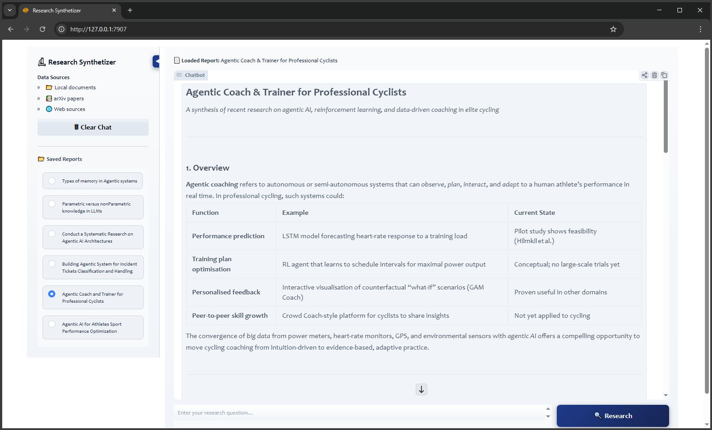

# Local LangChain AI Demos

A bunch of concise, production-ready examples showcasing **local LLM applications with LangChain + Ollama**.

## 1. [🔬 Research Synthetizer Assistant](langchain/research-synthetizer/Research-Synthesizer-Demo-LangChain-v1-Ollama-FAISS.ipynb)

**AI-powered research assistant that synthesizes comprehensive answers from multiple sources.**

## Features
- 📂 **Local Documents**: Index and search PDFs/TXT files via FAISS vector database
- 📚 **arXiv Papers**: Automatic academic paper retrieval and analysis
- 🌐 **Web Search**: Real-time information via Tavily API (optional)
- 🤖 **Smart RAG Pipeline**: HuggingFace embeddings + cross-encoder reranking
- 💬 **Modern UI**: Gradio interface with collapsible sidebar and report management

## Tech Stack
- **LLM**: Ollama (Qwen, Mistral) via LangChain/LangGraph
- **Vector DB**: FAISS with `all-MiniLM-L6-v2` embeddings
- **Reranking**: Cross-encoder `ms-marco-MiniLM-L-6-v2`
- **Interface**: Gradio 6.1+

## Quick Start
1. Place documents in `./research_docs`
2. Configure `CONFIG` dictionary (model, API keys, retrieval settings)
3. Run the app - it auto-indexes documents and launches web UI
4. Ask research questions - reports saved to `./report_docs`

*Research tool for educational purposes. Verify important information from primary sources.*

---
## 2. [Chatbot Assistant with Persistent Memory](langchain/Chatbot-with-Memory-and-Tools-Demo-w-LangChain-v1-Ollama-Gradio.ipynb)

A fully local, tool-enabled chatbot with session-isolated, persistent memory.

**Highlights**
- 🧠 Persistent memory via LangGraph `MemorySaver`
- 🔧 Tool calling (Wikipedia, Tavily, custom tools)
- 🤖 Local LLMs via Ollama (e.g. `qwen2.5:3b`)
- 🎨 Gradio UI with session state
- 🔒 Privacy-first, offline-capable

**Use cases:** personal assistants, research bots, privacy-sensitive apps.

---

## 3. [LangChain RAG](langchain/RAG-Demo-w-LangChain-v1-Ollama.ipynb)
A lightweight Retrieval-Augmented Generation (RAG) pipeline for grounded Q&A.

**Highlights**
- 📚 In-memory vector store with semantic search
- ✂️ Automatic document chunking + embeddings
- 🤖 Ollama-powered LLM (Mistral 7B)
- 💬 Single-turn and multi-turn chat modes
- 🧩 Pluggable embeddings (HF or fallback)

**Use cases:** document Q&A, knowledge assistants, RAG prototyping.

---

## Tech Stack
- LangChain (v1.0+)
- Ollama (local LLM inference)
- Gradio (chat UI)
- HuggingFace embeddings (optional)

**Goal:** demonstrate clean, modern patterns for building **local, private, LLM-powered systems** with memory, tools, and retrieval.
