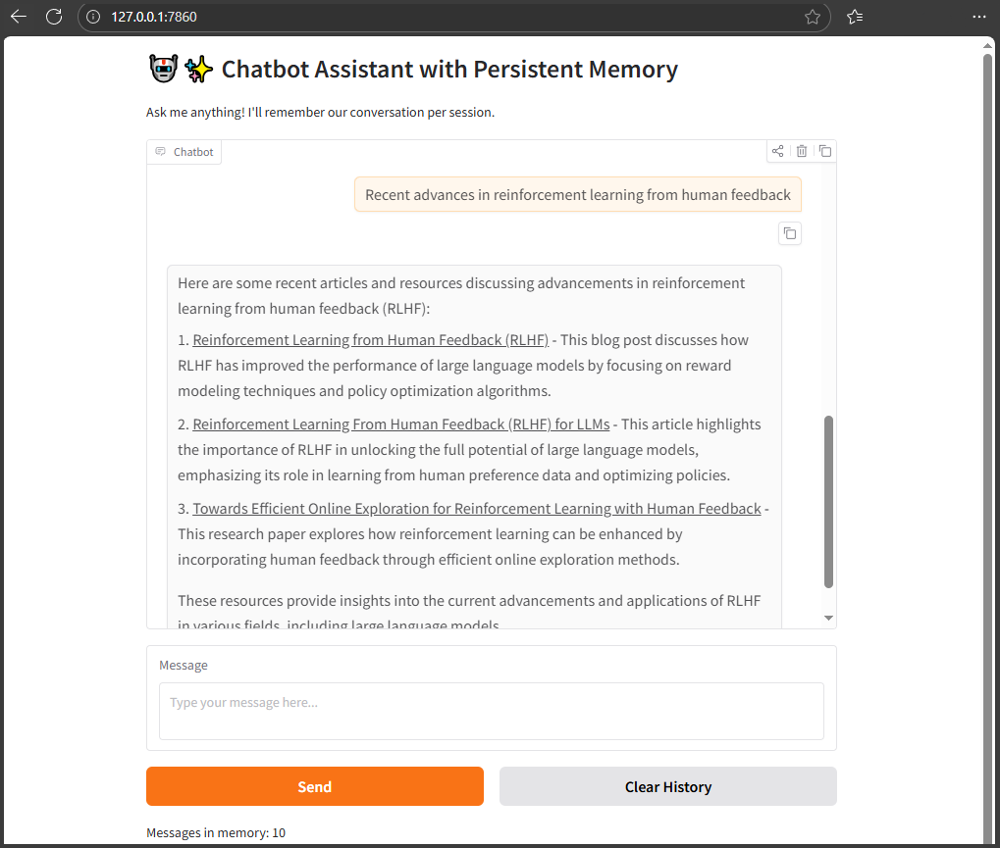

# Local LangChain AI Demos

Two concise, production-ready examples showcasing **local LLM applications with LangChain + Ollama**.

## 1. [Chatbot Assistant with Persistent Memory](langchain/LangChain-v1-Ollama-Gradio-Chatbot-with-Memory-and-Tools-Demo.ipynb)

A fully local, tool-enabled chatbot with session-isolated, persistent memory.

**Highlights**
- 🧠 Persistent memory via LangGraph `MemorySaver`
- 🔧 Tool calling (Wikipedia, Tavily, custom tools)
- 🤖 Local LLMs via Ollama (e.g. `qwen2.5:3b`)
- 🎨 Gradio UI with session state
- 🔒 Privacy-first, offline-capable

**Use cases:** personal assistants, research bots, privacy-sensitive apps.

---

## 2. [LangChain RAG Demo](langchain/LangChain-v1-RAG-Demo-with-Ollama.ipynb)
A lightweight Retrieval-Augmented Generation (RAG) pipeline for grounded Q&A.

**Highlights**
- 📚 In-memory vector store with semantic search
- ✂️ Automatic document chunking + embeddings
- 🤖 Ollama-powered LLM (Mistral 7B)
- 💬 Single-turn and multi-turn chat modes
- 🧩 Pluggable embeddings (HF or fallback)

**Use cases:** document Q&A, knowledge assistants, RAG prototyping.

---

## Tech Stack
- LangChain (v1.0+)
- Ollama (local LLM inference)
- Gradio (chat UI)
- HuggingFace embeddings (optional)

**Goal:** demonstrate clean, modern patterns for building **local, private, LLM-powered systems** with memory, tools, and retrieval.
